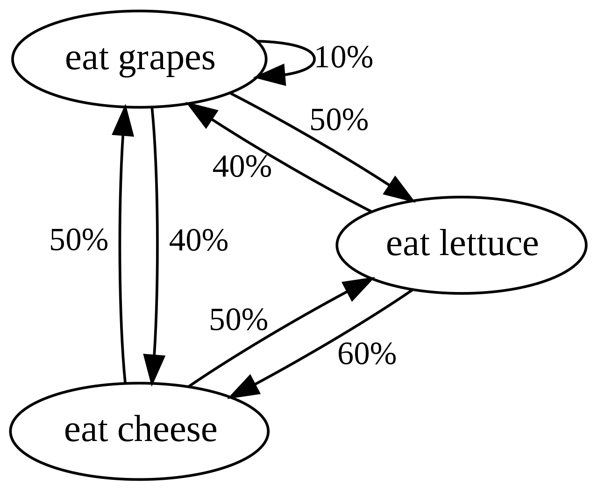

```{r setup, include=FALSE, echo=FALSE}
knitr::opts_chunk$set(echo = FALSE, warning = FALSE)

library(tidyverse)
library(scales)

theme_set(theme_light())
```

# Jak se počítají bayesiánské modely

## Analytický přístup

- Klasický přístup jsme si už ukázali, skrze bayesův teorém.

$$
P(Hypotéza|Data) = \frac{P(Data|Hypotéza) * P(Hypotéza)}{P(Data)}
$$

## Analytický přístup

- Výhoda - pokud funguje, výpočetně velmi rychlé (srovnatelné s maximum likelihood.)
\newline
- Nevýhoda - Výpočet $P(Data)$ vyžaduje integraci (resp. je integrál)
\newline
- Důvodem je nutnost standardizovat $P(Data|Hypotéza) * P(Hypotéza)$, aby šlo o platnou distribuční funkci

## Analytický přístup

- Integrál $P(Data)$ je v praxi spočitatelný za dvou podmínek:
    - Pokud používáme tzv. konjugální priory
    - pokud model samotný není moc složitý (tzn. nejde o multilevel nebo aditivní model apod.)
    
## Konjugální priory

- Konjugální prior je takový prior, který má rozdělení ze stejné rodiny jako posterior
\newline
- Např. Pokud má náš prior i naše likelihood normální rozdělení, potom bude mít i posterior normální rozdělení.

## Konjugální priory

- V praxi jsme tedy omezení na specifické priory:
    - Normální prior pro klasickou lineární regresi
    - Beta prior pro logistickou regresi

- Často ale chceme vybírat priory na základě teorie bez omezení + konjugální priory neřeší problém s výpočtem složitých modelů.

## Markov chain Monte Carlo

- Pokud se nedají bayesiánské modely počítat analyticky, dají se aproximovat simulačně
\newline
- Technika na výpočet bayesiánských modelů se nazývá Markov Chain Monte Carlo

## Markov chain

- Sekvence stavů, kdy následující stav závisí pouze na tom stávajícím, ale ne na těch předchozích

```{r markov-chain, echo=FALSE, out.height="5cm", fig.align='center'}

```

## Monte Carlo

- Pouze fancy název pro techniku simulace dat.
\newline
- Monte Carlo původně krycí název pro simulační techniky využité pro konstrokci atomové bomby.
\newline
- Dnes běžně využíváme např. u funkci `rnorm()`, `rbinom()` apod.

## Markov Chain Monte Carlo

- Kombinací těchto dvou technik můžeme tahat vzorky z postoriorní dostribuce, aniž bychom museli počítat $P(Data)$.
\newline
- Likelihood parametrů, které odhadujeme je vlastně prostor, kterým "cvrnkáme" fyzikální částici.
\newline
- Částici pravidelně zastavíme, zapíšeme si její pozici a vypustíme znovu.
\newline
- Místa, kde se částice zastaví jsou vzorky z posteriu, s dostatkem vzorků dostaneme dobrou představu o tvaru posterioru


## Markov Chain Monte Carlo

- Stan (jazyk, který používáme pro výpočet modelů) využívá Hamiltonské MCMC
\newline
- Grafické vysvětlení [zde](https://arogozhnikov.github.io/2016/12/19/markov_chain_monte_carlo.html)


## Markov Chain Monte Carlo

- Konceptuální znalost MCMC je důležitá:
    - Abyste chápali, proč je výpočet bayesiánských modelů tak pomalý (ve srovnání s MLE)
    - Abyste vědělii, jak interpretovat diagnostické grafy.